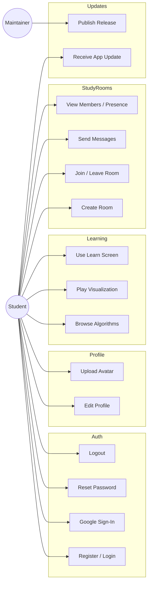
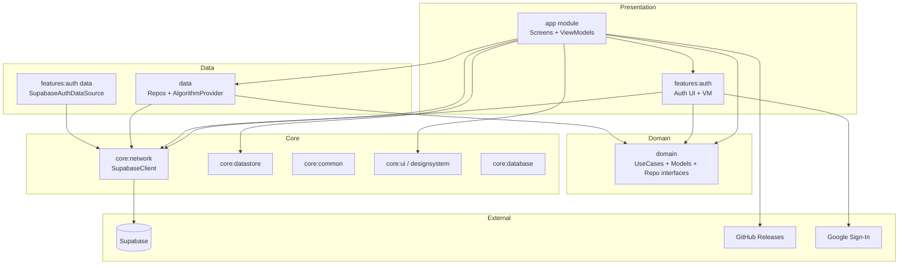
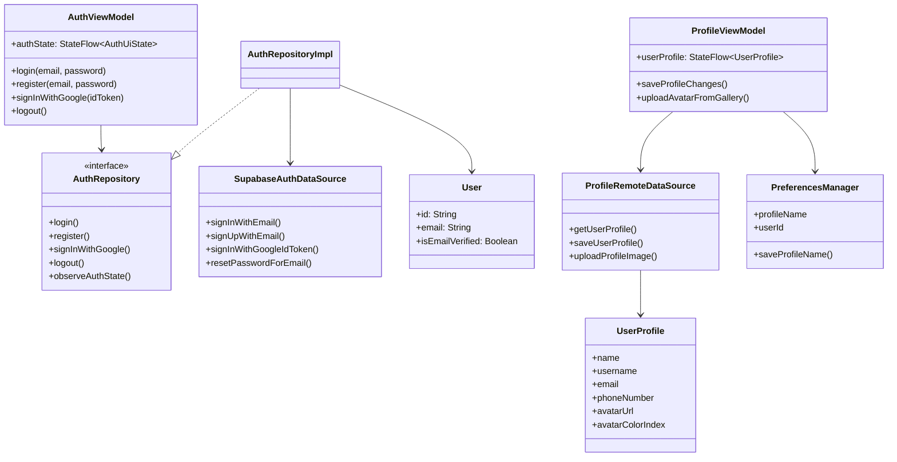
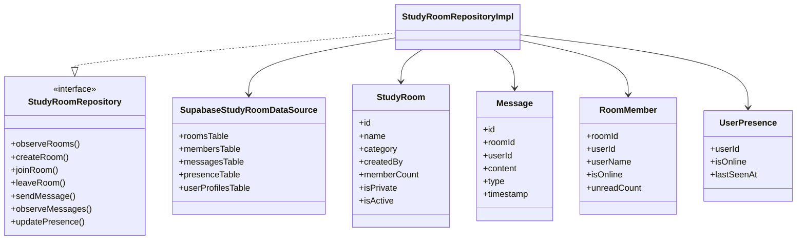
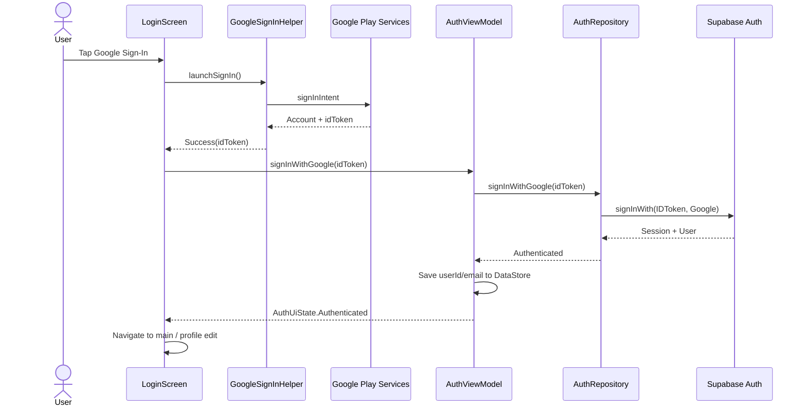
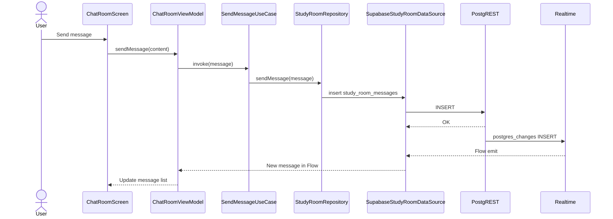
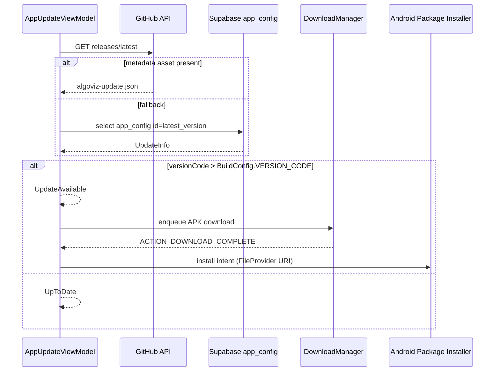
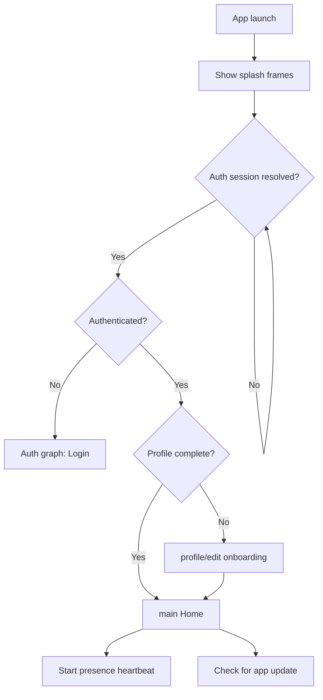
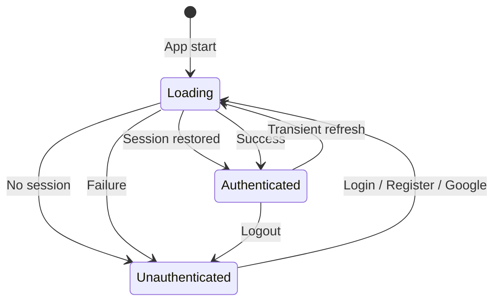
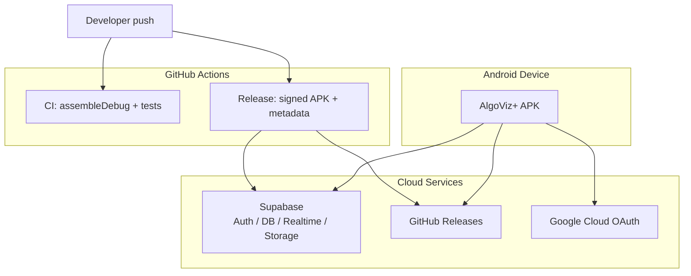

# UML Diagrams

**Product:** AlgoViz+  
**Notation:** Mermaid (render in GitHub, Notion, or Mermaid Live Editor)  
**Last updated:** 2026-07-04

---

## 1. Use case diagram

---

## 2. Package / component diagram

---

## 3. Class diagram — auth & profile (simplified)

---

## 4. Class diagram — study rooms (simplified)

---

## 5. Sequence — Google Sign-In

---

## 6. Sequence — send chat message

---

## 7. Sequence — app update check

---

## 8. Activity — app startup

---

## 9. State machine — auth UI

---

## 10. Deployment diagram

