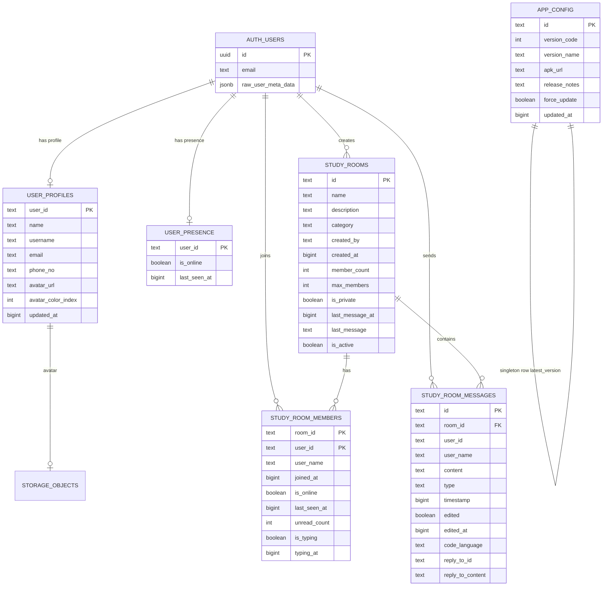

# Entity Relationship Diagram (ERD)

**Product:** AlgoViz+  
**Database:** PostgreSQL via Supabase (`public` schema + `auth` / `storage`)  
**Source of truth:** `scripts/supabase_full_recovery.sql`, `scripts/setup_user_profiles.sql`  
**Last updated:** 2026-07-04

---

## 1. Conceptual ERD



> Note: `AUTH_USERS` lives in Supabase `auth.users` (managed by Auth). App tables store `user_id` as **text** (`auth.uid()::text`).

---

## 2. Physical relationships

| Parent | Child | Relationship | On delete |
|--------|-------|--------------|-----------|
| `study_rooms.id` | `study_room_members.room_id` | 1:N | CASCADE |
| `study_rooms.id` | `study_room_messages.room_id` | 1:N | CASCADE |
| `auth.users.id` | `user_profiles.user_id` | 1:1 (logical) | App/trigger managed |
| `auth.users.id` | `user_presence.user_id` | 1:1 (logical) | App managed |

There are **no formal FKs** from app tables to `auth.users` (common Supabase pattern). Integrity is enforced by RLS (`user_id = auth.uid()::text`) and application logic.

---

## 3. Data dictionary

### 3.1 `public.user_profiles`

| Column | Type | Notes |
|--------|------|-------|
| `user_id` | text PK | `auth.users.id` as text |
| `name` | text NOT NULL DEFAULT '' | Display name |
| `username` | text NOT NULL DEFAULT '' | Handle |
| `email` | text NOT NULL DEFAULT '' | Profile email |
| `phone_no` | text NOT NULL DEFAULT '' | Phone |
| `avatar_url` | text NULL | Public Storage URL or Google picture |
| `avatar_color_index` | int NOT NULL DEFAULT 0 | Fallback avatar color |
| `updated_at` | bigint NULL | Epoch millis / seconds |

**Indexes:** `idx_user_profiles_user_id` (PK covers lookups)

### 3.2 `public.study_rooms`

| Column | Type | Notes |
|--------|------|-------|
| `id` | text PK | Client-generated ID |
| `name` | text NOT NULL | Room title |
| `description` | text | |
| `category` | text | GENERAL, ACADEMICS, etc. |
| `created_by` | text NOT NULL | Owner user_id |
| `created_at` | bigint NOT NULL | |
| `member_count` | int DEFAULT 0 | Denormalized |
| `max_members` | int DEFAULT 50 | |
| `is_private` | boolean DEFAULT false | |
| `last_message_at` | bigint | Preview |
| `last_message` | text | Preview |
| `is_active` | boolean DEFAULT true | Soft delete / hide |

### 3.3 `public.study_room_members`

| Column | Type | Notes |
|--------|------|-------|
| `room_id` | text PK | FK → study_rooms |
| `user_id` | text PK | Member |
| `user_name` | text NOT NULL | Denormalized display |
| `joined_at` | bigint NOT NULL | |
| `is_online` | boolean | Room-scoped online |
| `last_seen_at` | bigint | |
| `unread_count` | int | |
| `is_typing` | boolean | |
| `typing_at` | bigint | |

**Indexes:** `idx_study_room_members_user_id`

### 3.4 `public.study_room_messages`

| Column | Type | Notes |
|--------|------|-------|
| `id` | text PK | Message ID |
| `room_id` | text FK | Room |
| `user_id` | text | Sender |
| `user_name` | text | Denormalized |
| `content` | text | Body |
| `type` | text DEFAULT 'TEXT' | TEXT, CODE, IMAGE, … |
| `timestamp` | bigint | Order key |
| `edited` | boolean | |
| `edited_at` | bigint | |
| `code_language` | text | For CODE type |
| `reply_to_id` | text | Thread reply |
| `reply_to_content` | text | Snapshot |

**Indexes:** `idx_study_room_messages_room_timestamp (room_id, timestamp)`

### 3.5 `public.user_presence`

| Column | Type | Notes |
|--------|------|-------|
| `user_id` | text PK | Global presence |
| `is_online` | boolean | |
| `last_seen_at` | bigint | Heartbeat |

### 3.6 `public.app_config`

| Column | Type | Notes |
|--------|------|-------|
| `id` | text PK | Typically `latest_version` |
| `version_code` | int | Compared to `BuildConfig.VERSION_CODE` |
| `version_name` | text | Display |
| `apk_url` | text | Download URL |
| `release_notes` | text | |
| `force_update` | boolean | Block dismiss |
| `updated_at` | bigint | |

---

## 4. Storage model

| Bucket | Public | Path pattern | Purpose |
|--------|--------|--------------|---------|
| `Algoviz` | Yes | `profile_images/{user_id}.jpg` | Profile avatars |

Public URL pattern:

```
{SUPABASE_URL}/storage/v1/object/public/Algoviz/profile_images/{user_id}.jpg?t={version}
```

---

## 5. Auth-side entities (managed)

| Entity | Schema | Role |
|--------|--------|------|
| `auth.users` | auth | Identity, email, metadata |
| `auth.sessions` / tokens | auth | Session lifecycle |
| `storage.buckets` | storage | Bucket registry |
| `storage.objects` | storage | Avatar objects |

**Trigger:** `on_auth_user_created` → `handle_new_user()` inserts/updates `user_profiles` from `raw_user_meta_data`.

---

## 6. Client-only data (not in Postgres)

| Store | Data |
|-------|------|
| DataStore `algoviz_preferences` | Profile cache, userId, onboarding flag, learn playlists |
| Room `algoviz_database` | Placeholder (not primary) |
| In-memory | Algorithm catalog, visualization steps |

---

## 7. Denormalization notes

- `study_room_members.user_name` and message `user_name` avoid joins on every chat render.
- `study_rooms.member_count`, `last_message`, `last_message_at` speed room list UI.
- Profile avatars may also live in auth metadata (`picture`, `avatarUrl`) as fallback.

---

## 8. Migration / recovery scripts

| Script | Purpose |
|--------|---------|
| `scripts/supabase_studyroom_schema.sql` | Core tables |
| `scripts/setup_user_profiles.sql` | Profiles + RLS + trigger + backfill |
| `scripts/supabase_full_recovery.sql` | Full schema, RLS, storage, indexes |
| `scripts/supabase_complete_audit_fix.sql` | Audit + data fixes |
| `scripts/study_rooms_diagnostic.sql` | Diagnostics |
| `scripts/fix_study_rooms_member_data.sql` | Member/profile sync |
