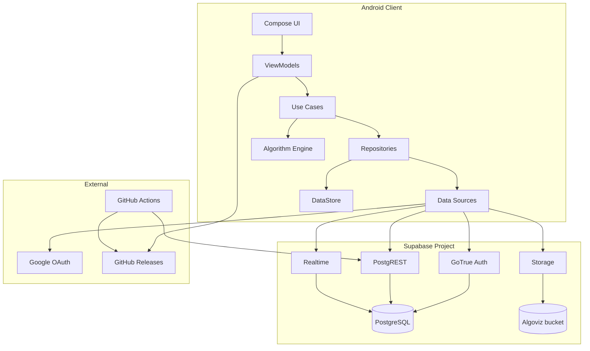
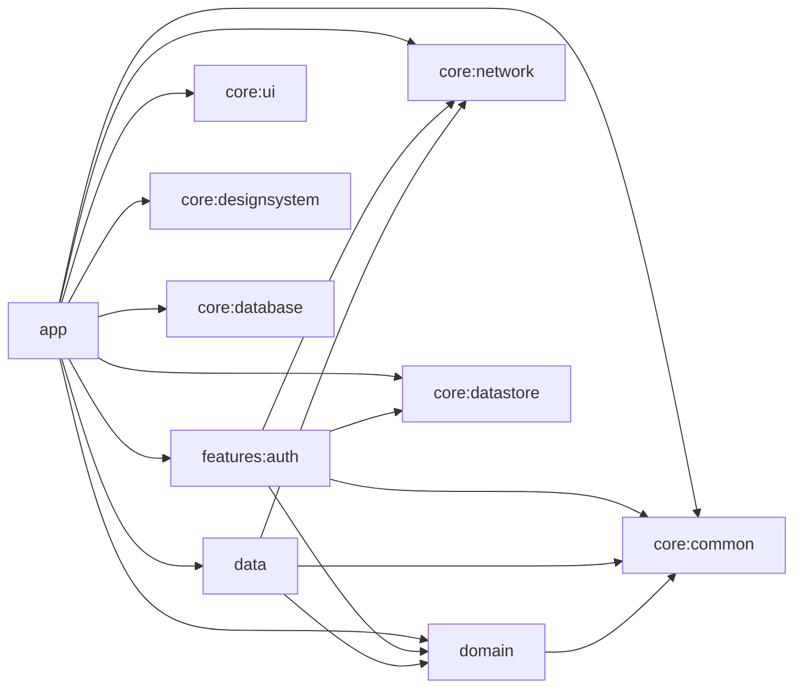
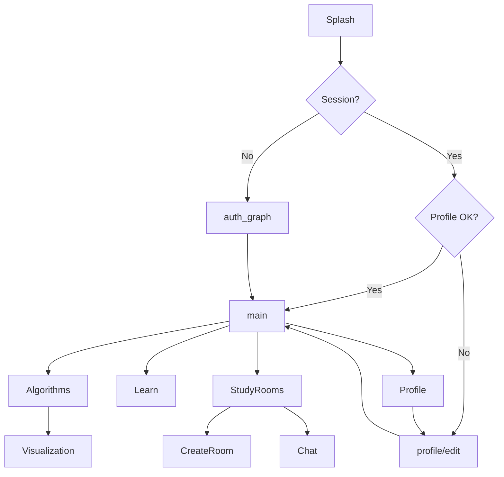
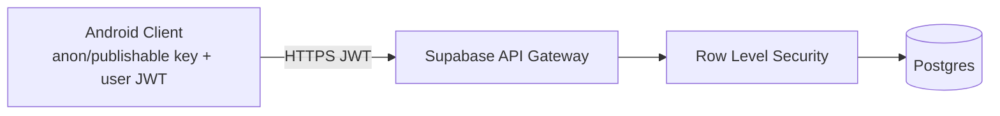
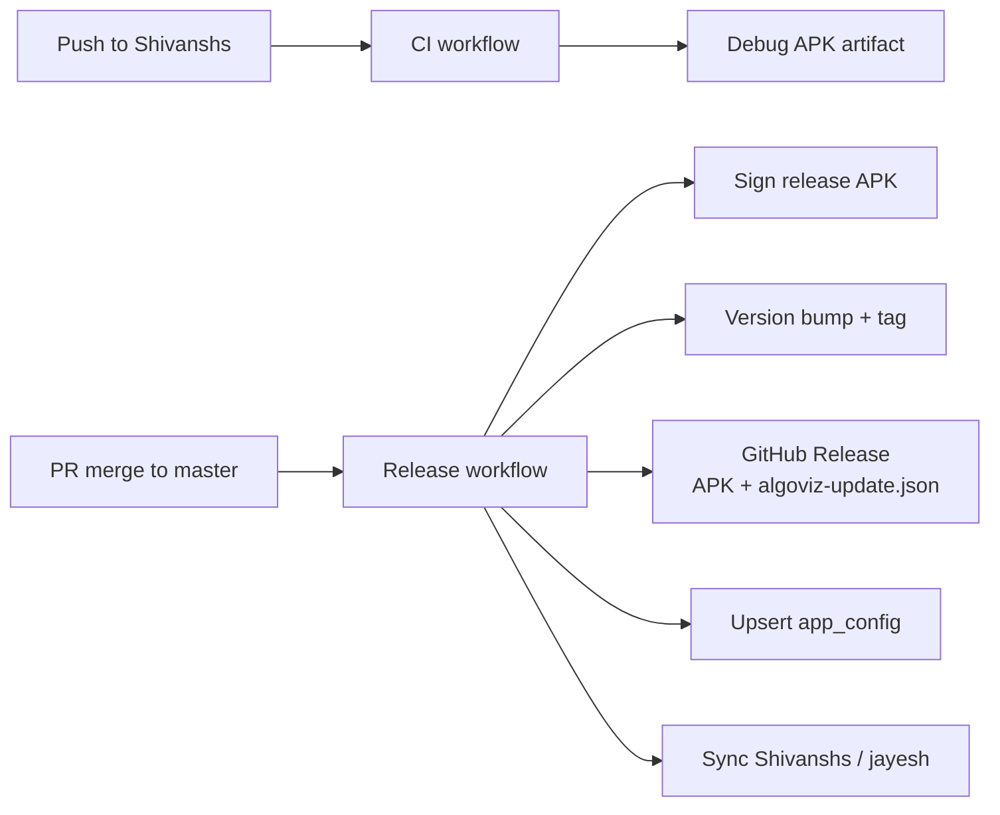

# System Architecture

**Product:** AlgoViz+  
**Last updated:** 2026-07-04

---

## 1. Architecture style

AlgoViz+ uses **Clean Architecture** with **MVVM** on Android:

- **Presentation** — Compose UI + ViewModels (StateFlow)
- **Domain** — Use cases + models + repository interfaces
- **Data** — Repository implementations + remote/local sources
- **Core** — Shared infrastructure (network, datastore, design system)

Primary backend is **BaaS (Supabase)** rather than a custom REST monolith. The Android client talks to Supabase Auth, PostgREST, Realtime, and Storage directly via the official Kotlin SDK.

---

## 2. High-level architecture

---

## 3. Module architecture

### Module roles

| Module | Architectural role |
|--------|--------------------|
| `app` | Composition root, navigation, feature screens not yet extracted |
| `features:auth` | Vertical auth slice (domain/data/presentation) |
| `domain` | Pure Kotlin business layer |
| `data` | Study rooms + algorithms implementations |
| `core:network` | Supabase client singleton |
| `core:datastore` | Preferences |
| `core:database` | Room (reserved / minimal) |
| `core:ui` / `designsystem` | Shared presentation primitives |

---

## 4. Runtime architecture

### 4.1 Process model

- Single Android process.
- `MainActivity` hosts `RootNavHost`.
- Presence heartbeat runs while activity is started (~25s).
- Coroutines on `viewModelScope` / IO dispatchers for network.

### 4.2 Navigation architecture

Overlays (not routes): `AppUpdateDialog`, `InAppNotificationHost`.

---

## 5. Backend architecture (Supabase)

| Service | Responsibility |
|---------|----------------|
| **Auth** | Users, sessions, email/password, Google ID token, password recovery |
| **PostgREST** | CRUD on `public.*` tables with JWT + RLS |
| **Realtime** | Postgres change streams for rooms/messages/members/presence |
| **Storage** | Public avatar objects in `Algoviz` bucket |
| **PostgreSQL** | Source of truth for app data |
| **Edge (none custom)** | No custom Edge Functions required for core flows |

### Trust boundary

The client is **untrusted**. Authorization is enforced by **RLS policies**, not by hiding endpoints.

---

## 6. CI/CD architecture

| Workflow | Trigger | Output |
|----------|---------|--------|
| `ci.yml` | push/PR `master`, `Shivanshs` | Debug build + unit tests |
| `release-update.yml` | push `master` (not bot, not `[skip release]`) | Signed APK, Release, Supabase config |

---

## 7. Security architecture

| Layer | Control |
|-------|---------|
| Transport | HTTPS to Supabase / GitHub / Google |
| AuthN | Supabase JWT (authenticated role) |
| AuthZ | Postgres RLS policies |
| Secrets | `local.properties` (local), GitHub Secrets (CI) |
| Signing | Release keystore in CI only |
| Storage | Path-scoped policies for avatars |
| OAuth | Web client ID in app; Android clients for package+SHA-1 |

---

## 8. Scalability considerations

| Concern | Approach |
|---------|----------|
| Chat volume | Indexed `(room_id, timestamp)`; realtime per-room channels |
| Room list | Denormalized `last_message`, `member_count` |
| Profile reads | PK lookup by `user_id`; DataStore cache |
| Algorithm load | Fully local — no backend cost |
| Updates | GitHub CDN for APK; lightweight metadata |

Bottlenecks to watch: realtime fan-out for large rooms, Storage bandwidth for avatars, GitHub API rate limits for update checks.

---

## 9. Availability & failure modes

| Failure | Client behavior |
|---------|-----------------|
| Auth down | Login fails with error; cached session may still work briefly |
| Profile table missing | Metadata fallback (resilient path) |
| Realtime disconnect | Flows may stall; app can re-subscribe on restart |
| Update check fails | Silent UpToDate — app not blocked |
| Download fails | DownloadFailed dialog with retry |

---

## 10. Technology decisions (ADRs summary)

| Decision | Choice | Rationale |
|----------|--------|-----------|
| Backend | Supabase | Fast auth + realtime + storage without custom server |
| UI | Compose | Modern Android UI, matches team stack |
| Architecture | Clean + MVVM | Testable domain, clear boundaries |
| Algorithms | Client-side | Offline, no compute cost |
| OTA | GitHub Releases | Fits open distribution; Supabase as fallback |
| DI | Hilt | Standard Android DI |

---

## 11. Future architecture options

- **KMP**: share `domain` + `data` with iOS.
- **Edge Functions**: server-side moderation, admin-only publish.
- **FCM**: push for chat when app backgrounded.
- **CDN**: dedicated APK hosting if GitHub limits bind.
