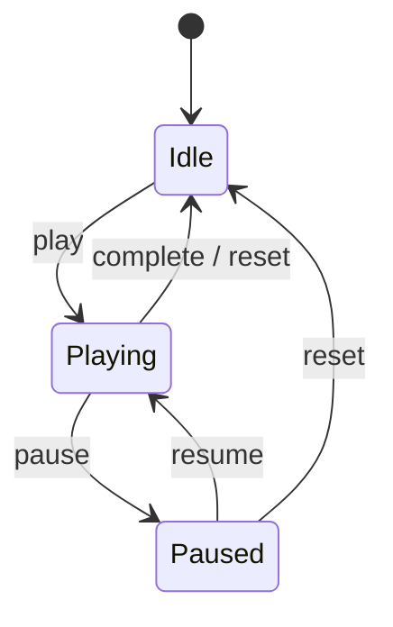

# System Design

**Product:** AlgoViz+  
**Last updated:** 2026-07-04

---

## 1. Design goals

1. **Learn offline** — algorithm visualizations must work without network.
2. **Collaborate online** — study rooms need low-latency chat and presence.
3. **Secure by default** — RLS owns authorization; client is untrusted.
4. **Ship continuously** — CI validates; `master` publishes signed updates.
5. **Recover gracefully** — profile/update failures must not brick the app.

---

## 2. Major subsystems

| Subsystem | Design approach |
|-----------|-----------------|
| Auth | Supabase session + Google ID token exchange |
| Profile | Local-first cache + remote upsert |
| Algorithms | Pure client generators + playback state machine |
| Study rooms | PostgREST writes + Realtime subscriptions |
| Updates | Pull metadata (GitHub primary, Supabase secondary) |

---

## 3. Auth design

### 3.1 Session model

- Supabase SDK owns session persistence.
- `AuthViewModel` observes `SessionStatus` and maps to `AuthUiState`.
- `pendingAuthOperation` prevents race where observer overwrites Loading with Unauthenticated during sign-in.
- Splash waits for **initial auth resolve**, not perpetual Loading.

### 3.2 Google Sign-In design

```
Android OAuth client (package + SHA-1)
        ↓ enables Play Services to issue token
Web client ID (requestIdToken)
        ↓ ID token audience
Supabase Google provider (accepts Web + Android client IDs)
        ↓ creates session
auth.users + handle_new_user → user_profiles
```

**Critical config:** Release APK SHA-1 must match Google Cloud Android client for `com.algoviz.plus`.

### 3.3 Password reset

1. `resetPasswordForEmail` with redirect `algovizplus://password-reset`.
2. `MainActivity` / Supabase `handleDeeplinks`.
3. `ResetPasswordScreen` updates password.

---

## 4. Profile design

### 4.1 Local-first

1. Read/write DataStore immediately for responsive UI.
2. Upsert `user_profiles` asynchronously.
3. On remote failure, keep local data and show soft error.

### 4.2 Hydration

After `userId` appears in DataStore:

1. Retry remote fetch up to 12 times (auth may still be settling).
2. Prefer table row; else auth metadata (`name`, `full_name`, `picture`, …).
3. If table missing, log warning and use metadata (no crash loop).

### 4.3 Avatar pipeline

1. Read image bytes from gallery/camera URI.
2. Upload to `Algoviz/profile_images/{uid}.jpg` with upsert.
3. Build public URL with cache-bust query.
4. Save URL into profile row + metadata (best effort).
5. Delete previous object path if different.

---

## 5. Algorithm visualization design

### 5.1 Catalog

- Static list in `AlgorithmProvider` (~37 algorithms).
- Categories: sorting, searching, graph, tree, DP, greedy, backtracking, divide-and-conquer, string, trie.

### 5.2 Playback



- `GenerateAlgorithmStepsUseCase` produces ordered `AlgorithmStep` list.
- UI advances index based on `PlaybackSpeed`.
- No network dependency.

---

## 6. Study rooms design

### 6.1 Write path

Client generates IDs → insert/update via PostgREST → RLS validates → Realtime broadcasts.

### 6.2 Read path

- Initial select for history/list.
- `postgresChangeFlow` / channel subscriptions for live updates.
- Channels examples: room members `room-members-{roomId}`, presence `user-presence-{userId}`.

### 6.3 Presence

| Scope | Table / field | Update |
|-------|---------------|--------|
| Global | `user_presence` | Heartbeat every ~25s while started |
| Room | `study_room_members.is_online` | Join/leave/chat activity |

On activity stop: mark offline.

### 6.4 Consistency model

- **Eventual consistency** for member counts and last message previews.
- Chat messages are append-only inserts (edits/deletes supported where implemented).
- Denormalized `user_name` may lag profile renames until next sync.

### 6.5 Notifications

`GlobalStudyRoomNotificationViewModel` + `InAppNotificationHost` surface in-app events and navigate to `chat/{roomId}`.

---

## 7. Update system design

### 7.1 Priority

1. GitHub `releases/latest` → asset `algoviz-update.json`
2. Else Supabase `app_config` where `id = 'latest_version'`

### 7.2 Install

1. `DownloadManager` to app external files.
2. On complete, resolve local URI.
3. If install permission missing (API 26+), open settings and resume on return.
4. `FileProvider` URI → package installer intent.

### 7.3 Release pipeline design

- Auto-bump `versionCode` / `versionName` on `master`.
- Commit with `[skip release]` to avoid infinite loop.
- Upload APK + JSON to GitHub Release.
- Service-role script updates Supabase `app_config`.
- Merge release commit back into `Shivanshs` / `jayesh`.

---

## 8. Concurrency & threading

| Work | Dispatcher / scope |
|------|--------------------|
| UI state | Main / `viewModelScope` |
| Network / DB | IO (`withContext(Dispatchers.IO)`) |
| Realtime flows | Cold flows collected in ViewModels |
| Presence | Periodic coroutine in `MainActivity` lifecycle |

---

## 9. Caching strategy

| Data | Cache | Invalidation |
|------|-------|--------------|
| Profile | DataStore | Overwrite on hydrate/save |
| Session | Supabase SDK | Logout / expiry |
| Rooms/messages | In-memory Flow | Realtime events |
| Algorithms | Code constants | App update |
| Update info | Ephemeral in VM | App launch / resume |

---

## 10. Error & UX design principles

1. **Never block core learning** on update check failure.
2. **Local-first profile** so edits survive flaky network.
3. **Actionable auth errors** (especially Google DEVELOPER_ERROR with package/SHA-1 hint).
4. **Grace period on logout redirect** (~1.2s) to avoid flicker on session blips.
5. **Force profile onboarding** only when name/username incomplete.

---

## 11. Capacity planning (qualitative)

| Scenario | Expected behavior |
|----------|-------------------|
| 50 members / room | Within `max_members` default |
| Burst messages | Realtime delivers; UI list grows |
| Many rooms | List query + filters; indexes on members by user |
| Avatar uploads | Single object per user (upsert) |

---

## 12. Threat model (summary)

| Threat | Mitigation |
|--------|------------|
| User reads others' private profiles | RLS: own row or shared active room |
| User spoofs another user_id | RLS `auth.uid()::text` checks |
| Stolen anon key | Expected; RLS still applies |
| Malicious APK update URL | Only trust GitHub/Supabase metadata from maintainers |
| Keystore leak | Rotate only with Play App Signing strategy; never commit |

---

## 13. Design trade-offs

| Trade-off | Choice | Cost |
|-----------|--------|------|
| BaaS vs custom API | Supabase | Less backend control; RLS complexity |
| Denormalized names | Faster chat UI | Stale names after rename |
| Client algorithms | Offline | Larger APK / no server analytics |
| GitHub OTA | Simple | SHA-1/signing must stay consistent |
| Profile in app module | Faster delivery | Harder to share as feature module |

---

## 14. Related documents

- [Architecture](./05_SYSTEM_ARCHITECTURE.md)
- [API & Backend](./07_API_BACKEND_AUTH_STORAGE.md)
- [ERD](./04_ERD.md)
- [UML](./03_UML.md)
