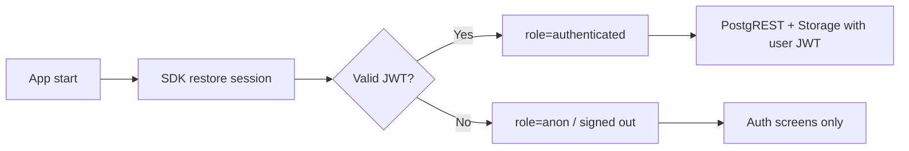

# API, Backend Logic, Database, Storage, Auth & Permissions

**Product:** AlgoViz+  
**Backend:** Supabase project `zosawqjebxkjppwtkegx`  
**Client SDK:** `supabase-kt` 3.x  
**Last updated:** 2026-07-04

---

## 1. Overview

AlgoViz+ does **not** expose a custom application server. The Android client uses:

| Service | Base usage |
|---------|------------|
| Auth (GoTrue) | `/auth/v1/*` via SDK |
| PostgREST | `/rest/v1/{table}` via SDK |
| Realtime | WebSocket channels via SDK |
| Storage | `/storage/v1/*` via SDK |
| GitHub API | HTTPS for release metadata (client) |

Legacy Retrofit base `https://api.algoviz.app/` exists in `NetworkModule` but is **not** used for primary product flows.

---

## 2. Authentication

### 2.1 Providers

| Provider | Flow |
|----------|------|
| Email / password | `signUpWith(Email)`, `signInWith(Email)` |
| Google | Play Services ID token → `signInWith(IDToken) { provider = Google }` |
| Password recovery | `resetPasswordForEmail` + deep link |

### 2.2 Client configuration

| Setting | Value / source |
|---------|----------------|
| `SUPABASE_URL` | `https://zosawqjebxkjppwtkegx.supabase.co` |
| `SUPABASE_KEY` | Publishable / anon key (client) |
| `GOOGLE_WEB_CLIENT_ID` | Web OAuth client ID |
| Deep link | `algovizplus://password-reset` |

### 2.3 Auth API operations (logical)

| Operation | SDK / behavior | App entry |
|-----------|----------------|-----------|
| Register | Email sign-up | `RegisterUseCase` |
| Login | Email sign-in | `LoginUseCase` |
| Google login | ID token exchange | `GoogleSignInUseCase` |
| Logout | Sign out session | `LogoutUseCase` |
| Current user | Session / user observe | `GetCurrentUserUseCase` |
| Resend verification | OTP email signup | `SendEmailVerificationUseCase` |
| Reset email | Recovery email | `SendPasswordResetEmailUseCase` |
| Update password | Recovery session | `UpdatePasswordUseCase` |
| Change password | Re-auth then update | `ChangePasswordUseCase` |

### 2.4 Session lifecycle



JWT claims used by RLS: `auth.uid()`, role `authenticated`.

### 2.5 Google OAuth requirements

| Item | Release | Debug |
|------|---------|-------|
| Package | `com.algoviz.plus` | `com.algoviz.plus.debug` |
| Android OAuth client | Required | Separate client required |
| SHA-1 | Release keystore (CI) | Debug keystore |
| Web client ID in app | Same Web client | Same Web client |
| Supabase Client IDs | Web + all Android client IDs | Include debug Android client |

Supabase Google provider **Client IDs** (comma-separated example):

```
755994556793-ra0a3m34q7etiinrlsum293hiq267ngd.apps.googleusercontent.com,
755994556793-m5jnt8tlnhlj4plq53841llscga94ed.apps.googleusercontent.com
```

Callback URL:

```
https://zosawqjebxkjppwtkegx.supabase.co/auth/v1/callback
```

### 2.6 Auto profile creation

Trigger `on_auth_user_created` on `auth.users` runs `handle_new_user()`:

- Inserts into `user_profiles` from `raw_user_meta_data` (`name`, `full_name`, `picture`, etc.).
- `ON CONFLICT (user_id) DO UPDATE` / `DO NOTHING` depending on script version.

---

## 3. Database API (PostgREST)

All tables are accessed as:

```
GET/POST/PATCH/DELETE {SUPABASE_URL}/rest/v1/{table}
Headers:
  apikey: <publishable key>
  Authorization: Bearer <user JWT>
  Prefer: ...
```

The app uses the Kotlin PostgREST DSL (`supabaseClient.postgrest["table"]`).

### 3.1 Tables and operations

#### `user_profiles`

| Op | Filter / body | Who |
|----|---------------|-----|
| SELECT | `user_id=eq.{uid}` limit 1 | Own profile; co-members in active rooms (full recovery policy) |
| INSERT | Full profile payload | Own `user_id` only |
| UPDATE | `user_id=eq.{uid}` | Own row only |
| DELETE | `user_id=eq.{uid}` | Own row only |

**Payload fields:** `user_id`, `name`, `username`, `email`, `phone_no`, `avatar_url`, `avatar_color_index`, `updated_at`

**App logic (`ProfileRemoteDataSource`):**

1. Select existing row.
2. Insert if missing, else update.
3. Best-effort `auth.updateUser { data = metadata }`.

#### `study_rooms`

| Op | Purpose |
|----|---------|
| SELECT | List active rooms |
| INSERT | Create room |
| UPDATE | Last message, member_count, soft deactivate |
| DELETE / soft | Deactivate room (`is_active=false`) as implemented |

**Create payload (logical):** `id`, `name`, `description`, `category`, `created_by`, `created_at`, `member_count`, `max_members`, `is_private`, `is_active`

#### `study_room_members`

| Op | Purpose |
|----|---------|
| SELECT | Members for room / rooms for user |
| INSERT | Join room |
| UPDATE | online, typing, unread |
| DELETE | Leave room |

**PK:** `(room_id, user_id)`

#### `study_room_messages`

| Op | Purpose |
|----|---------|
| SELECT | History by `room_id` ordered by `timestamp` |
| INSERT | Send message |
| UPDATE | Edit own message |
| DELETE | Delete own message |

**Message types:** `TEXT`, `CODE`, `IMAGE`, `FILE`, `AUDIO`, `SYSTEM` (domain enum)

#### `user_presence`

| Op | Purpose |
|----|---------|
| UPSERT / UPDATE | Heartbeat online/offline |
| SELECT | Presence for users |

#### `app_config`

| Op | Purpose |
|----|---------|
| SELECT | `id=eq.latest_version` (authenticated) |
| UPSERT | Admin / CI service role publish |

---

## 4. Backend business logic (client + DB)

### 4.1 Create room

1. Authenticated user generates room `id`.
2. Insert `study_rooms` with `created_by = uid`.
3. Insert creator into `study_room_members`.
4. Set `member_count = 1`.
5. Realtime notifies listeners.

### 4.2 Join room

1. Check room active and capacity (`member_count < max_members`) in app logic.
2. Insert member row with `user_name` from profile/identity utils.
3. Increment `member_count` (sync use case may reconcile).

### 4.3 Send message

1. Build `Message` with id, roomId, userId, content, type, timestamp.
2. Insert `study_room_messages`.
3. Update room `last_message`, `last_message_at`.
4. Realtime delivers to subscribers.

### 4.4 Presence heartbeat

1. While `MainActivity` started: every ~25s `UpdateUserPresenceUseCase(uid, true)`.
2. On stop: `UpdateUserPresenceUseCase(uid, false)`.

### 4.5 Profile save

1. Validate name ≠ default, username non-blank.
2. Persist DataStore.
3. Upsert `user_profiles`.
4. Mark onboarding complete on success.

### 4.6 Update check

1. HTTP GET GitHub latest release JSON.
2. Download `algoviz-update.json` asset if present.
3. Else select `app_config` row `latest_version`.
4. If `version_code > BuildConfig.VERSION_CODE` → show dialog.

---

## 5. Realtime API

| Channel / subscription | Events | Consumers |
|------------------------|--------|-----------|
| Rooms list changes | INSERT/UPDATE/DELETE on rooms, members, messages | Study rooms list |
| `room-members-{roomId}` | Member changes | Chat member list |
| `user-presence-{userId}` | Presence updates | Presence UI |
| Message flows | Message inserts for room | Chat timeline |

Transport: Supabase Realtime WebSocket authenticated with user JWT.

---

## 6. Storage API

### 6.1 Bucket

| Property | Value |
|----------|-------|
| Bucket id/name | `Algoviz` |
| Public | `true` |
| Object path | `profile_images/{auth.uid()}.jpg` |

### 6.2 Operations

| Op | Policy intent |
|----|---------------|
| Upload (upsert) | Authenticated user, own path only |
| Update | Own path only |
| Delete | Own path only |
| Public read | Via public URL (bucket public) |

### 6.3 Client flow

```kotlin
storage.from("Algoviz").upload("profile_images/$uid.jpg", bytes) { upsert = true }
// public URL:
// $SUPABASE_URL/storage/v1/object/public/Algoviz/profile_images/$uid.jpg?t=$timestamp
```

---

## 7. Permissions (RLS)

Policies from `scripts/supabase_full_recovery.sql` (authoritative for full deploy).

### 7.1 `user_profiles`

| Policy | Command | Rule |
|--------|---------|------|
| `user_profiles_select_access` | SELECT | `user_id = auth.uid()::text` **OR** user shares an active study room |
| `user_profiles_insert_own` | INSERT | `user_id = auth.uid()::text` |
| `user_profiles_update_own` | UPDATE | own row |
| `user_profiles_delete_own` | DELETE | own row |

Minimal setup (`setup_user_profiles.sql`) allows **own-row SELECT only** (no room co-member read). Prefer full recovery for study rooms.

### 7.2 `app_config`

| Policy | Command | Rule |
|--------|---------|------|
| `app_config_select_auth` | SELECT | `authenticated` can read |

Writes typically use **service role** from CI (`publish-update.mjs`), bypassing RLS.

### 7.3 Study room tables

Policies enable authenticated users to:

- Select active rooms / messages / members as defined in recovery SQL.
- Insert rooms and memberships for self.
- Update/delete own messages and own membership/presence rows.

Exact policy names include patterns like:

- `study_rooms_select_all_active`
- `study_room_messages_insert_sender` (`user_id = auth.uid()::text`)
- `user_presence_*_own`

See `scripts/supabase_full_recovery.sql` lines ~263–435 for full definitions.

### 7.4 Storage policies

| Policy | Command | Rule |
|--------|---------|------|
| `Avatar auth select own` | SELECT | `bucket_id = 'Algoviz'` and name = `profile_images/{uid}.jpg` |
| `Avatar auth insert own` | INSERT | same path |
| `Avatar auth update own` | UPDATE | same path |
| `Avatar auth delete own` | DELETE | same path |

Public bucket URLs allow browser/app image load without listing.

### 7.5 Permission matrix (summary)

| Resource | Anon | Authenticated self | Other authenticated | Service role |
|----------|------|--------------------|---------------------|--------------|
| Own profile | — | R/W | — | R/W |
| Other profile (shared room) | — | R (full recovery) | R | R/W |
| Rooms / messages | — | Per RLS | Per RLS | R/W |
| Presence | — | Own W, others R | R | R/W |
| `app_config` | — | R | R | R/W |
| Avatar object | Public URL read | Own W | Public URL read | R/W |

---

## 8. External APIs

### 8.1 GitHub Releases

```
GET https://api.github.com/repos/Harry0786/ALGOVIZ/releases/latest
```

Parse `assets[]` for:

| Asset | Purpose |
|-------|---------|
| `algoviz-update.json` | Version metadata |
| `algoviz-v{version}-{code}.apk` | Installable APK (URL inside JSON) |

### 8.2 CI publish (service role)

`scripts/release/publish-update.mjs` (invoked by release workflow):

- Uses `SUPABASE_URL` + `SUPABASE_SERVICE_ROLE_KEY`.
- Upserts `app_config` row `latest_version`.

---

## 9. Error catalog (client-facing)

| Source | Example | User guidance |
|--------|---------|---------------|
| Google `DEVELOPER_ERROR` | Misconfigured OAuth | Package + SHA-1 + Web client ID |
| PostgREST missing table | `user_profiles` not in schema cache | Run setup/recovery SQL |
| RLS violation | Insert/update blocked | Policies / wrong user_id |
| Storage denied | Avatar upload fail | Bucket policies / path |
| Network | Timeouts | Retry |

---

## 10. Secrets inventory

| Secret | Where | Purpose |
|--------|-------|---------|
| `SUPABASE_URL` | local / GH | API base |
| `SUPABASE_KEY` | local / GH | Client publishable key |
| `SUPABASE_SERVICE_ROLE_KEY` | GH / scripts only | Bypass RLS for publish |
| `GOOGLE_WEB_CLIENT_ID` | local / GH | Google ID token audience |
| `ANDROID_KEYSTORE_BASE64` | GH only | Release signing |
| `ANDROID_STORE_PASSWORD` | GH only | Keystore |
| `ANDROID_KEY_ALIAS` | GH only | Alias |
| `ANDROID_KEY_PASSWORD` | GH only | Key |

**Never commit** service role key or keystore.

---

## 11. Deployment checklist (backend)

1. Run `scripts/supabase_full_recovery.sql` in SQL Editor.
2. Verify tables, policies, bucket `Algoviz`.
3. Configure Google provider Client IDs + secret.
4. Confirm Android OAuth clients for release (and debug) SHA-1s.
5. Set GitHub Actions secrets.
6. Merge to `master` to publish update metadata.

---

## 12. Related scripts

| File | Role |
|------|------|
| `scripts/supabase_full_recovery.sql` | Full schema + RLS + storage + trigger |
| `scripts/setup_user_profiles.sql` | Profiles only |
| `scripts/supabase_studyroom_schema.sql` | Tables only |
| `scripts/supabase_complete_audit_fix.sql` | Data repair |
| `scripts/release/publish-update.mjs` | CI → `app_config` |
