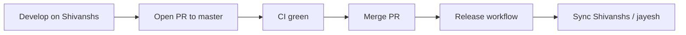

# Project Management

**Product:** AlgoViz+  
**Repository:** `https://github.com/Harry0786/ALGOVIZ`  
**Last updated:** 2026-07-04

---

## 1. Project identity

| Field | Value |
|-------|--------|
| Product name | AlgoViz+ |
| Code name / repo | ALGOVIZ |
| Platform | Android |
| Package (release) | `com.algoviz.plus` |
| Current version | `2.0.13` (`versionCode` 18) — bumps on release |
| Primary backend | Supabase `zosawqjebxkjppwtkegx` |
| Distribution | GitHub Releases + in-app OTA |

---

## 2. Roles and responsibilities

| Role | Who (examples) | Responsibilities |
|------|----------------|------------------|
| Product owner / maintainer | Repo owner (`Harry0786`) | Releases, secrets, Play/signing keystore, merge to `master` |
| Feature developer | Collaborators (e.g. `Shivanshs`) | Feature branches, PRs, CI green |
| Backend admin | Maintainer | Supabase SQL, RLS, Google OAuth, service role |
| QA | Team / self | Manual test on debug + release APKs |

---

## 3. Branching strategy

| Branch | Purpose |
|--------|---------|
| `master` | Production; triggers **Build and Publish Android Update** |
| `Shivanshs` | Active development branch |
| `jayesh` | Peer development branch (synced after release) |
| Feature PRs | Into `master` or via `Shivanshs` |

### Flow



**Rules:**

- Do **not** expect release publish on `Shivanshs` push (CI only).
- Release commits use `[skip release]` to avoid loops.
- Prefer PR merge over force-push to `master`.

---

## 4. Workstreams

| Workstream | Status | Notes |
|------------|--------|-------|
| Auth (email + Google) | Active | SHA-1 must match release keystore |
| Profiles + avatars | Active | Requires `user_profiles` + `Algoviz` bucket |
| Study rooms + chat | Active | Requires full recovery SQL |
| Algorithm visualizations | Stable | Local catalog |
| OTA updates | Active | GitHub primary, Supabase fallback |
| CI/CD | Active | `ci.yml`, `release-update.yml` |
| Cross-platform | Future | Not started |

---

## 5. Roadmap (suggested)

### Phase A — Stabilize production (current)

- [x] Supabase auth integration
- [x] Study rooms schema + RLS scripts
- [x] Profile remote hydrate + fallback
- [x] CI on `Shivanshs` / `master`
- [x] Release workflow on `master`
- [ ] Confirm release SHA-1 in Google Cloud
- [ ] Full recovery SQL applied on production project
- [ ] Green release build (AGP/R8 fix merged)

### Phase B — Product polish

- [ ] Wire admin update screen into nav (if needed)
- [ ] Improve unread / notification reliability
- [ ] Profile rename sync to room member names
- [ ] Crash-free update install on all OEMs

### Phase C — Growth

- [ ] FCM push notifications
- [ ] Analytics (privacy-safe)
- [ ] Play Store distribution (optional)
- [ ] Cross-platform exploration (KMP)

---

## 6. Definition of Done

A feature is **Done** when:

1. Code merged to target branch.
2. CI passes (debug build + unit tests).
3. Manual smoke test on relevant variant (debug and/or release).
4. Backend SQL/policies updated if schema changed.
5. Docs updated if contracts changed (`docs/` or `AUTH_SETUP.md`).
6. No secrets committed.

A **release** is Done when:

1. Release workflow succeeds on `master`.
2. GitHub Release contains APK + `algoviz-update.json`.
3. `app_config` updated (if service role configured).
4. Google Sign-In works on installed release APK.
5. Version tags present (`vX.Y.Z`).

---

## 7. Environments

| Env | App ID | Backend | Signing |
|-----|--------|---------|---------|
| Debug | `com.algoviz.plus.debug` | Same Supabase (or override URL) | Debug keystore |
| Staging | `com.algoviz.plus.staging` | Optional URL override | Optional staging keystore |
| Release | `com.algoviz.plus` | Production Supabase | CI release keystore |

---

## 8. Risk register

| Risk | Impact | Likelihood | Mitigation |
|------|--------|------------|------------|
| Wrong release SHA-1 | Google Sign-In broken | High if new keystore | Document SHA-1; verify with `keytool` on APK |
| Missing SQL tables | Profile/rooms fail | Medium on new project | Run `supabase_full_recovery.sql` |
| Lost keystore | Cannot update signed app | Low/Med | Backup keystore offline; owner custody |
| Service role leak | Full DB access | Low | GH secrets only; never in APK |
| R8 / AGP mismatch | Release build fails | Medium | Keep AGP current (8.7+) |
| Realtime cost/limits | Chat degradation | Low | Monitor Supabase usage |

---

## 9. Communication & artifacts

| Artifact | Location |
|----------|----------|
| Product requirements | `docs/01_PRD.md` |
| Technical design | `docs/02_TLD.md`, `docs/06_SYSTEM_DESIGN.md` |
| Architecture | `docs/05_SYSTEM_ARCHITECTURE.md` |
| Data model | `docs/04_ERD.md` |
| API / auth / RLS | `docs/07_API_BACKEND_AUTH_STORAGE.md` |
| UML | `docs/03_UML.md` |
| Auth setup | `AUTH_SETUP.md` |
| SQL scripts | `scripts/` |
| CI/CD | `.github/workflows/` |

---

## 10. Sprint / task template

Use this checklist for each PR:

```markdown
## Summary
- What changed and why

## Test plan
- [ ] Debug build installs
- [ ] Login (email / Google as applicable)
- [ ] Affected feature smoke test
- [ ] No secrets in diff

## Backend
- [ ] N/A or SQL applied / documented

## Release impact
- [ ] None / needs master merge / needs OAuth or SQL change
```

---

## 11. Release checklist (maintainer)

1. PR CI green on `Shivanshs`.
2. Supabase schema/RLS current.
3. Google OAuth SHA-1 matches CI keystore.
4. GitHub secrets present (signing + Supabase + Google).
5. Merge PR → `master`.
6. Watch **Build and Publish Android Update** (~6+ min).
7. Download APK from Releases; verify Google Sign-In + update metadata.
8. Confirm `Shivanshs` synced with release commit.

---

## 12. Onboarding checklist (new developer)

1. Clone repo; copy `local.properties.template` → `local.properties`.
2. Set `sdk.dir`, `SUPABASE_URL`, `SUPABASE_KEY`, `GOOGLE_WEB_CLIENT_ID`.
3. Open in Android Studio; sync Gradle.
4. Create debug Android OAuth client for `com.algoviz.plus.debug` + debug SHA-1.
5. Run `assembleDebug`; test login.
6. Read `docs/README.md` and `AUTH_SETUP.md`.
7. Work on `Shivanshs` (or feature branch); open PR.

---

## 13. Metrics (suggested)

| Metric | How to observe |
|--------|----------------|
| CI success rate | GitHub Actions |
| Release success rate | Release workflow history |
| Auth failures | Logcat / Supabase Auth logs |
| Active study rooms | SQL count `study_rooms where is_active` |
| Profiles completeness | SQL `username = ''` counts |

---

## 14. Document ownership

| Doc | Owner | Review cadence |
|-----|-------|----------------|
| PRD | Product / lead | Per major feature |
| TLD / Architecture / Design | Tech lead | Per architecture change |
| ERD / API / RLS | Backend-aware engineer | Per schema change |
| Management | Lead | Monthly or per release |

Update `Last updated` when material changes land.
